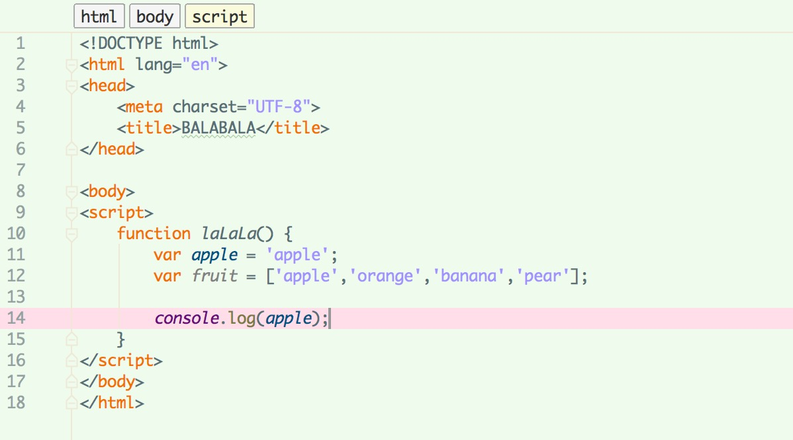

# Canditax-IDEA-Theme
一个用在IntelliJ IDEA, PhpStorm, PyCharm, RubyMine,(以上所述都没尝试过，别打我( >﹏<。) WebStorm的主题。
自己在用的噢，感觉这个颜色既护眼又清新（balabala

## Install?
这里提供两种方法！
不过，你还是先`git clone https://github.com/RenmuNyan/Canditax-IDEA-Theme.git Canditax-IDEA-Theme`一下？
还是先`Download ZIP`一下？

### Option 1 - 直接导入的方式！
在**WebStorm**中的`File`下有`Import Settings`,选择刚刚Download的`Canditax.jar`然后OK，导入后会提示重启编辑器，然后就……结束啦~

### Option 2 - 如果你比较作的话！
1.  或许你会只Download一个`Canditax.icls`
2.  那么，默默的把它放到...等一下！好像系统不同放的地方不同！

    **Mac OS X**

    * IntelliJ IDEA: `~/Library/Preferences/IntelliJIdea{version}/colors`
    * WebStorm `~/Library/Preferences/WebStorm{version}/colors`
    * PyCharm `~/Library/Preferences/PyCharm{version}/colors`

    **Windows**
    * IntelliJ IDEA `%USERPROFILE%\.IdeaIC{version}\config\colors` 
    * PyCharm `%USERPROFILE%\.PyCharm{version}\config\colors`

3.  重启一下编辑器
4.  到编辑器的`Preferences | Editor | Colors & Fonts`下，选择Canditax
5.  然后就……结束啦，Enjoy it.

## Support
NEW:尝试了*Java*的Hello World 好像支持不错的样纸？

其他的不知道，因为只用*JavaScript* (不要打我！｡･ﾟ(ﾟ⊃ω⊂ﾟ)ﾟ･｡)...So
- [x] JavaScript
- [x] HTML
- [x] TypeScript
- [x] Java
